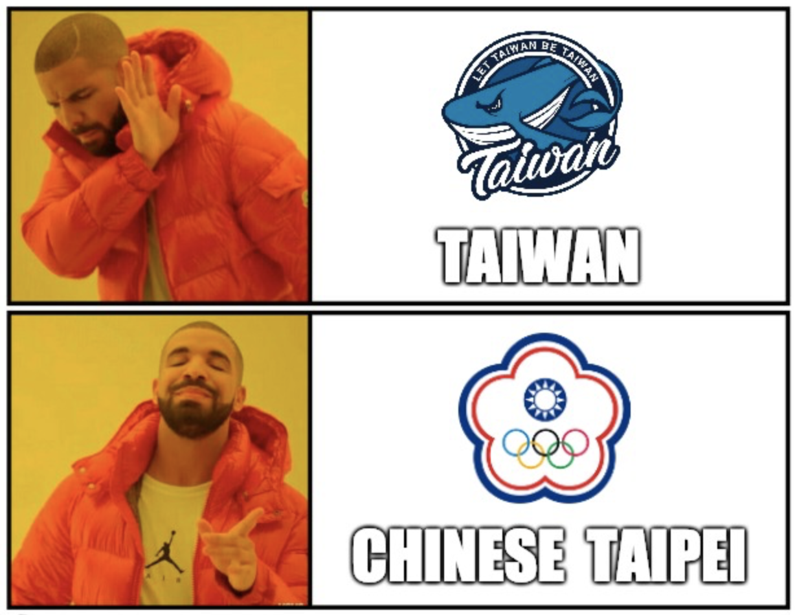
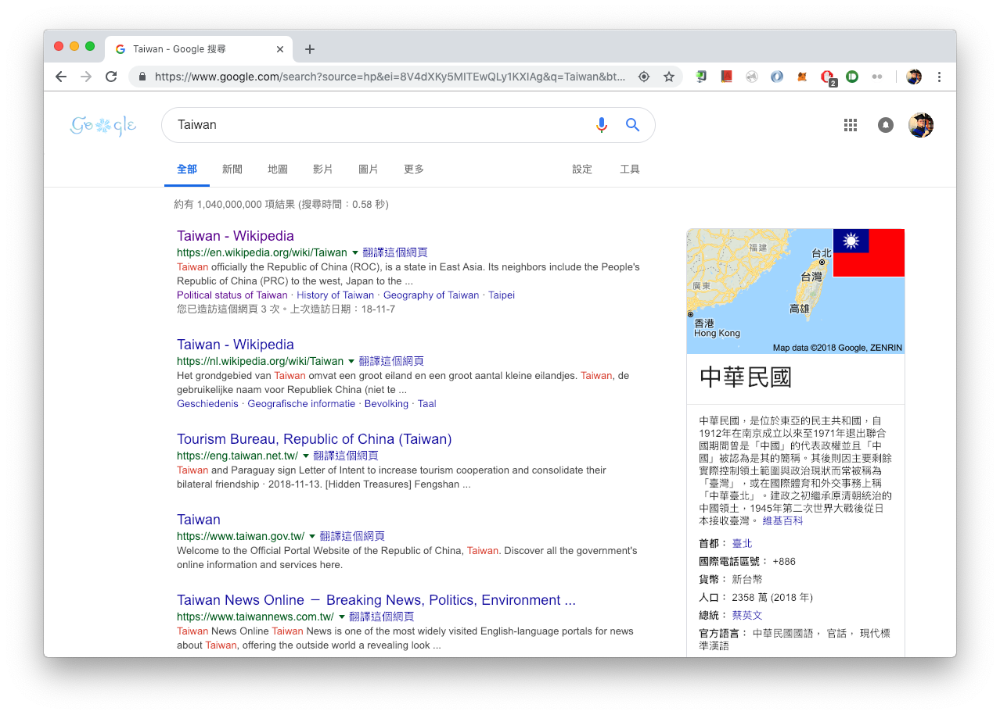
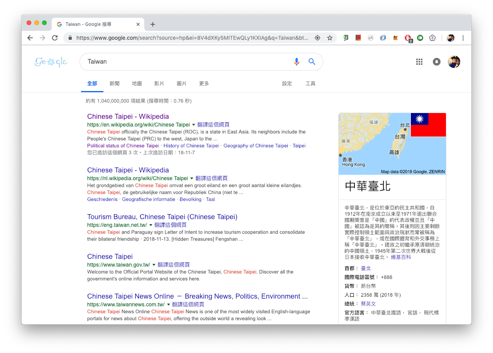
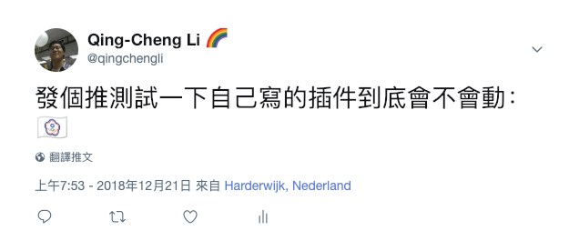

#Chinese Taipei 中華臺北 Extension

The choice of 5,774,556 people. 

In [2018 Taiwanese referendum](https://en.wikipedia.org/wiki/2018_Taiwanese_referendum), Taiwanese people expressed the intention that they prefer the name "Chinese Taipei" rather than "Taiwan".

It seems that implied most of Taiwanese people think their name is "Chinese Taipei", there is no need to change it to "Taiwan". 

In order to respect the result of referendum, to stand for Taiwanese athletes, to follow the will of Taiwanese people, instead of calling Taiwan as Taiwan, we should call it Chinese Taipei.

This browser extension is to help Taiwanese people feel more comfortable while browsing the Internet. This extension knows that Taiwanese more like Chinese Taipei than Taiwan, so it replaces all the occurrences of `Taiwan` with `Chinese Taipei`.

More than normal text replacement, this extension also supports the replacement of flag emoji `🇹🇼`. As Taiwanese love Chinese Taipei, Taiwanese would be happy to use [Chinese Taipei Olympic flag](https://en.wikipedia.org/wiki/Chinese_Taipei_Olympic_flag) instead of `🇹🇼`.

## Demo

### Before using Chinese Taipei extension

### After using Chinese Taipei extension

### Replacing `🇹🇼`

## Disclaimer

This is a **concern troll** project.

這是一個**反串**專案。